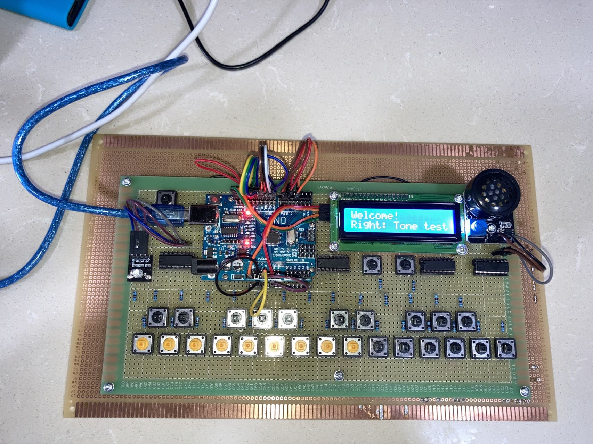

arduino-piano
=============
***
This Arduino project uses Arduino UNO board, four 8-bit PISO registers, one LCD display, 27 push bottons and resistors, one amplifier speaker, one RGB LED module.   
The project has two functionalities: one is the piano, the other one is perfect pitch tester.   
In piano mode, you can move tones by using two menu buttons.   
In perfect pitch test mode, you will hear random tones and find the tones.   

To build the project, open `piano.ino` and add LCD I2C library.   
[Link to LCD I2C library](https://github.com/fdebrabander/Arduino-LiquidCrystal-I2C-library)

### Project picture

